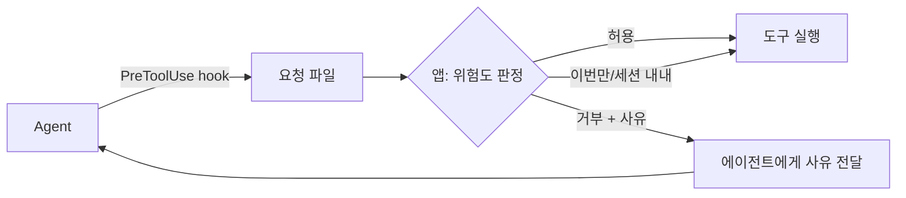

<div align="center">

# Puppeteer

**여러 프로젝트의 Claude Code 세션을 한 화면에서 관리하는 데스크톱 앱**

터미널을 프로젝트 수만큼 띄우는 대신, 하나의 창에서<br/>
프로젝트를 넘나들며 세션을 굴리고 · 권한을 통제하고 · 산출물을 모아 봅니다.

<br/>


</div>

---

## 왜 만들었나

CLI 하나로 코딩 에이전트를 쓰는 건 충분히 잘 됩니다. 문제는 **프로젝트가 여러 개일 때**입니다.

- 어느 창에서 뭐가 돌고 있는지 기억해야 한다
- 승인 요청이 스크롤에 묻혀 지나간다
- 지난주에 뭘 시켰는지 찾으려면 터미널 히스토리를 뒤져야 한다
- 코드 블록이 대화에 섞여 흘러가 버린다

이 앱은 그 네 가지를 화면 구조로 푼 것입니다.

---

## 무엇을 하나

### 실행 환경을 사람마다 다르게

같은 Windows PC라도 누구는 네이티브, 누구는 WSL에 CLI를 깔아 씁니다.
macOS/Linux에서는 POSIX 설치 경로를 훑습니다.
설치된 실행 환경을 **자동 탐지**하고, **프로젝트별로** 무엇을 쓸지 첫 지시 시점에 정합니다.

```
Provider          Runner
claude-cli   ×    windows-native
codex-cli         wsl (배포판별)
                  posix (macOS/Linux)
                  custom
```

WSL의 CLI를 부를 때는 반드시 **탐지된 절대경로**로 실행합니다.
`wsl -- claude` 는 interop PATH 때문에 Windows 쪽 설치본을 잡아 다른 자격증명으로 돌아갑니다.

### 권한을 가로채서 묻는다

에이전트가 파일을 쓰거나 명령을 돌리기 직전에 **앱이 먼저 받습니다.**



거부해도 세션은 죽지 않습니다. 사유를 되돌려주면 에이전트가 다른 방법을 찾습니다.
요청·응답은 **파일**로 주고받습니다 — WSL2는 NAT라 WSL→Windows localhost가 통하지 않습니다.

### 대화와 산출물을 분리

긴 코드 블록이 대화에 섞여 스크롤로 흘러가지 않게, 오른쪽 **Artifact 패널**로 뺍니다.
"나중에 다시 볼 가치가 있는 것"만 담습니다.

| 도구 | Artifact |
|---|---|
| Write (신규) | `code` — 확장자로 언어 추론 |
| Write/Edit (수정) | `diff` — 추가/삭제 줄 배경색 |
| Bash | 8줄 초과 또는 stderr 있을 때만 `log` |
| Read · Glob · Grep | 없음 (입력·탐색) |

패널은 접을 수 있고, 경계선을 끌어 폭을 조절합니다.

### 에이전트를 한곳에서 관리

역할·도구 권한·완료 조건·**적용 대상 프로젝트**를 앱이 전역으로 보관합니다.
프로젝트마다 파일을 흩어두지 않으므로, 어떤 에이전트를 어디서 쓰는지 목록에서 바로 보입니다.

```yaml
---
name: refactor-agent
description: 리팩터링 전담. 기능 변경 없이 구조만 정리한다.
model: opus
x-workspace:                      # 앱 전용 설정은 표준 필드를 안 건드리게 분리
  projects: ['D:\work\api', 'D:\work\web']   # 비우면 전체 프로젝트
  allowedTools: [Read, Edit]
  completion: 테스트 통과 후 변경 요약 보고
---
```

실행할 때는 파일을 배치하지 않고 CLI 에 정의를 통째로 넘깁니다(`--agents` + `--agent`).
러너마다 홈 디렉터리가 다른 문제(WSL `~` ≠ Windows `%USERPROFILE%`)를 아예 피합니다.

형식은 Claude Code 표준 프론트매터 그대로라, **프로젝트로 내보내면 앱 없이
`claude --agent <name>` 으로도 동작**합니다.

### 홈에서 지시하면 에이전트를 찾아준다

프로젝트를 먼저 고르지 않고 "무엇을 해야 하는지"만 적으면,
라이브러리의 에이전트 중 맞는 것을 찾아 제안합니다.
어디서 돌릴지는 그 에이전트의 **적용 대상** 중에서 고릅니다.

```
지시 입력
  → 라이브러리의 에이전트 수집
  → 후보 1개면 모델 호출 없이 / 여럿이면 haiku 1회로 선택
  → 확인 카드 (제안 + 이유 + 실행할 프로젝트 선택)
  → [실행] 눌러야 세션 시작
```

**자동 실행하지 않습니다.** 실행 대상 프로젝트가 바뀌는 동작이라 확인을 거칩니다.
맞는 에이전트가 없으면 없다고 답합니다 — 억지로 고르지 않습니다.

### 그 밖에

- **멀티 세션** — 여러 프로젝트에서 동시에 굴리고, 같은 파일을 건드리면 경고
- **Git 스냅샷** — 세션 시작 시점을 찍어두고 "이 세션이 바꾼 것"만 diff로
- **이미지 첨부·주석** — 드래그앤드롭 / 붙여넣기, 캔버스에 화살표·텍스트
- **Command Palette** — `Ctrl + Space`
- **다크 / 라이트** — Catppuccin Mocha · Latte
- **비용·한도** — 세션별 비용과 rate limit 진행률

---

## 구조

```
┌────────┬──────────────────────┬─────────┐
│  Rail  │  Session Tabs        │         │
│        ├──────────────────────┼─────────┤
│ 프로젝트│  Conversation        │Artifacts│
│ 승인   │                      │  (접기) │
│ 실행중 ├──────────────────────┤         │
│ 사용량 │  Prompt              │         │
└────────┴──────────────────────┴─────────┘
```

```
app/src/
├── main/                  Electron 메인
│   ├── adapters/          CLI 어댑터 (stream-json → 앱 이벤트)
│   ├── approval-broker.ts 승인 요청 감시·응답
│   ├── router.ts          홈 지시 → 에이전트 라우팅
│   ├── runner-detect.ts   실행 환경 탐지
│   ├── session-manager.ts 세션 생명주기
│   ├── agent-library.ts   전역 에이전트 라이브러리 (가져오기·내보내기)
│   ├── db.ts              node:sqlite
│   └── git.ts             스냅샷·diff
├── preload/               contextBridge
├── renderer/              React UI
└── shared/                양쪽이 함께 쓰는 타입
```

---

## 시작하기

**필요한 것**

- Node 20.19+ (권장: 현재 LTS 이상)
- Claude Code CLI 또는 Codex CLI
- macOS/Linux: 일반 POSIX 경로에 CLI 설치
- Windows: Windows 네이티브 또는 WSL 중 한 곳에 CLI 설치

```bash
cd app
npm install
npm run dev
```

`npm install` 은 `postinstall` 로 `install-electron` 을 실행해 Electron 실행 바이너리(약 100MB)를 내려받습니다.
Electron 43 부터는 `electron` 패키지 자체에 postinstall 이 없어, 이 단계 없이는 `npm run dev` 가 실행되지 않습니다.
다운로드가 실패했다면 `npx install-electron` 을 다시 실행하세요.

`npm run dev` 는 `electron-vite dev` 를 직접 부르지 않고 `scripts/run-electron-vite.mjs` 를 거칩니다.
이 래퍼는 `ELECTRON_RUN_AS_NODE` 같은 부모 환경 변수를 정리하고 로컬 `electron-vite` CLI를 Node로 실행해,
macOS와 Windows 양쪽에서 Electron 실행 경로가 흔들리지 않게 합니다.

### 검증 명령

```bash
npm run typecheck   # 타입 검사
npm test            # 단위 테스트
npm run build       # 타입 검사 + 번들
npm run smoke       # 빌드 후 실제 Electron 앱 최소 실행
npm run e2e         # 가짜 CLI로 실제 세션·어댑터·SQLite 영속화 확인
npm run verify      # 단위 테스트 + 빌드 + Electron smoke + E2E
```

`npm run smoke` 는 빌드된 Electron 앱을 실제로 띄운 뒤 렌더러 로드, runner 감지, 정상 종료까지 확인합니다.
`npm run e2e` 는 가짜 CLI로 세션을 시작해 어댑터 이벤트와 SQLite 저장·복원까지 확인합니다.
전체 릴리스 확인 절차는 [`docs/검증체크리스트.md`](docs/검증체크리스트.md) 에 정리했습니다.

로그인은 CLI가 알아서 안내합니다. 세션이 `auth-required` 로 끝나면 화면에 안내 카드가 뜹니다.

---

## 설계 메모

만들면서 밟은 함정과 그 대응을 남겨뒀습니다. 같은 스택을 쓴다면 몇 개는 그대로 겪습니다.

| 증상 | 원인 |
|---|---|
| `spawn EINVAL`·프롬프트 따옴표 손상 | `.cmd`/`.bat`를 `cmd.exe /d /s /c`로 감싸고 각 인자를 Windows 규칙으로 인용한다 |
| WSL 세션이 인증 실패 | `wsl -- claude` 가 Windows 설치본을 잡는다 → 탐지된 절대경로로 |
| 문법 강조가 조용히 실패 | shiki 기본 엔진이 WASM → 렌더러 CSP가 차단. JS 정규식 엔진으로 교체 |
| 코드가 한 줄씩 떠 보임 | shiki는 줄 사이에 개행을 넣는다. `.line{display:block}` 이면 두 줄이 된다 |
| 큰 이미지 첨부 실패 | `String.fromCharCode(...arr)` 인자 개수 초과 → 청크로 나눠 base64 |
| 네이티브 모듈 빌드 불가 | TLS 검사 프록시 뒤에서는 헤더를 못 받는다 → `node:sqlite` 로 우회 |

**조용한 폴백을 만들지 않는다** 가 이 중 여러 건에서 얻은 교훈입니다.
문법 강조 실패를 평문으로 넘기던 동안에는 원인을 알 수 없었습니다. 실패는 화면에 남겨야 진단이 됩니다.

전체 기록은 [`docs/기술스택.md`](docs/기술스택.md) §15, 제품 정의는 [`docs/기획서.md`](docs/기획서.md) 에 있습니다.

---

<div align="center">
<sub>개인 프로젝트입니다. 특정 회사·조직과 관련 없습니다.</sub>
</div>
